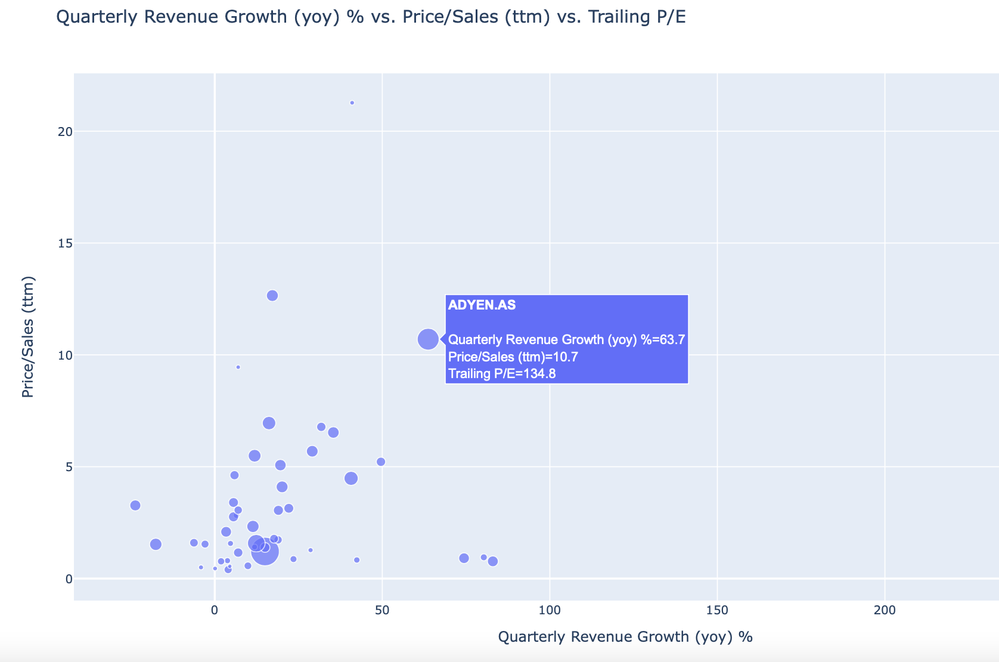

# Project_EUROSTOXX

## Brief Description.
This project was made for the Data Processing in Python course at IES FSV UK. 
It aims to scrape tickers of current companies in the EUROSTOXX50 index and link them with relevant financial ratios and other data from Yahoo Finance. 
Furthermore, these results can be visualized on a series of graphs in order to find possible value stocks from companies in the index.

## Potential Output Plot

## Contribution
This project can be used to identify possible value stocks in EUROSTOXX50 index based on the financial ratios extracted from Yahoo Finance. 
The composition of the index and financial ratios of companies are updated every time the code is run. Main ambition of the project is thus to quickly identify European value stocks with up-to-date data, instead of manual extraction ticker by ticker from Yahoo Finance page.

## Main issues / Possible improvements
* It seems that Yahoo Finance does not focus on European stocks as much as stock on NYSE, NASDAQ etc. 
* This causes issues in downloading the ratios and financial data for the tickers if the code is run during closed exchanges, especially during weekends and evenings. Unlike stocks listed on US exchanges, Yahoo Finance sometimes does not keep financial ratios for European stocks during closed exchanges, but instead, the ratios are shown to be N/A. Thus, this caused issues in downloading data, since the code could not match company's tickers with relevant ratios. 
* We solved this by including "try: except: pass" into the loop, which excluded the tickers with unavailable info. For the best performance, however, the code should be used during open exchanges, when all data is available at Yahoo Finance.
* The lack of avaliable data disallowed proper scheduling - which is further explained at the very end of the project. 

* The graphs do not seem to be displayed on GitHub, even though there were displayed initially. Therefore, the script should ideally be run in an Jypiter Notebook or directly in VSCODE. 

## Potential Additions

The script could be connected to a trading API - for educational purposes, one where "paper money" (i.e. virtual fake money on a hypothesical trading account) are avaliable. Such as the Alpaca API. Then, one could create an algotrader which buys stocks of a ticker meets certain criteria and sells if the ticker did not meet the criteria. 

Thereby, the code could run run a simply cronjob in the background as no visualisation is needed unless specifically demanded by the user. 

## Authors
This project was developed by Jiri Kos and Sebastian Wium Berko Laursen. Their contacts are provided below:
* Jiri Kos (41000203@fsv.cuni.cz)
* Sebastian Wium Berko Laursen (40568463@fsv.cuni.cz)

