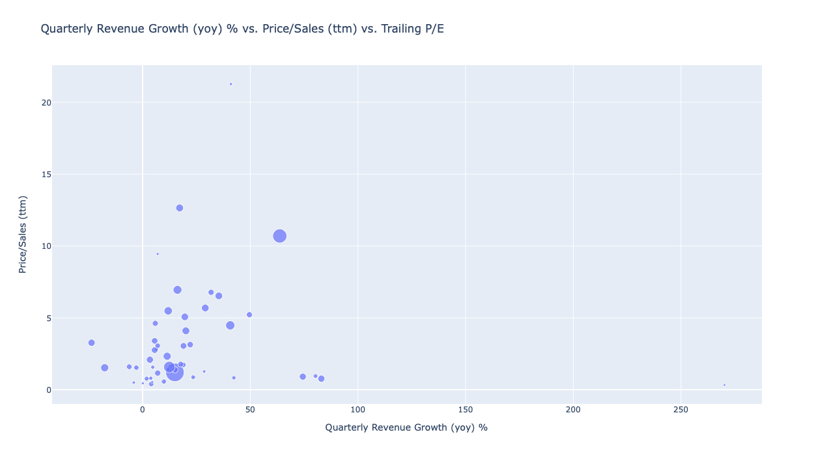

# Project_EUROSTOXX

## Brief description.
This project was made for the Data Processing in Python course at IES FSV UK. It aims to scrape tickers of current companies in the EUROSTOXX50 index and link them with relevant financial ratios and other data from Yahoo Finance. Furthermore, these results can be visualized on a series of graphs in order to find possible value stocks from companies in the index.

## Potential output plot

## Contribution
This project can be used to identify possible value stocks in EUROSTOXX50 index based on the financial ratios extracted from Yahoo Finance. The composition of the index and financial ratios of companies are updated every time the code is run. Main ambition of the project is thus to quickly identify European value stocks with up-to-date data, instead of manual extraction ticker by ticker from Yahoo Finance page.

## Authors
This project was developed by Jiri Kos and Sebastian Wium Berko Laursen. Their contacts are provided below:
* Jiri Kos (41000203@fsv.cuni.cz)
* Sebastian Wium Berko Laursen (40568463@fsv.cuni.cz)

